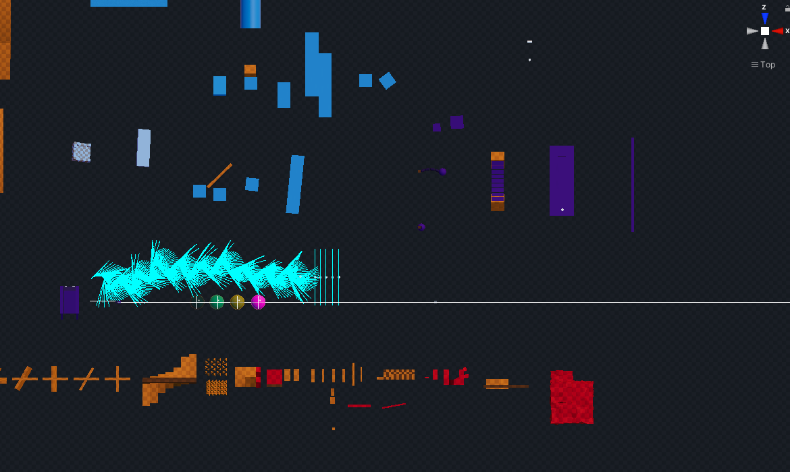
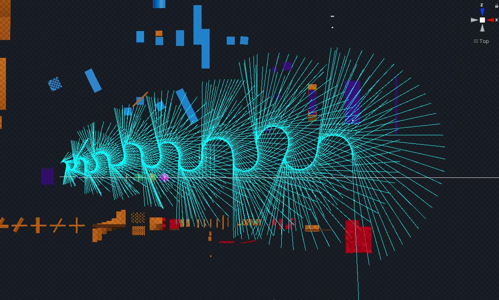

# Bunny Hopping

"Bunny Hopping" (or "b-hop") is a common character movement exploit found in many FPS games, which allows you to break the intended speed limit of your character while in air. It is the often-unintentional consequence of calculating character air movement in a certain way that tries to impose a max air velocity from movement input, while still allowing for momentum from external forces (gravity, impacts, explosions) to accumulate beyond that max velocity. With this way calculating it, having a character velocity goal that constantly rotates will result in the character gaining more and more speed.

Read more: [Bunnyhopping](https://wiki.sourceruns.org/wiki/Bunnyhopping#:~:text=Bunny%20Hopping%20is%20a%20movement,Engine%20and%20Portal%202%20speedrunning.)

Rival's `CharacterControlUtilities.StandardAirMove` (which is used in the default generated character's `HandleCharacterControl`) calculates air movement in such a way. It has a parameter named `forceNoMaxSpeedExcess`. If this parameter is set to false (it is false by default), and you give your character a high-enough air acceleration (something like 400), you will have a character that can b-hop.

Here is a top-down visualization of the "Basic Sample" character's velocity (cyan-colored lines) with and without `forceNoMaxSpeedExcess`, while it is doing the b-hop movements.

`forceNoMaxSpeedExcess` = true:

`forceNoMaxSpeedExcess` = false:

You can notice that when `forceNoMaxSpeedExcess` is false, the character's velocity towards the left of the image starts out being the same length as when `forceNoMaxSpeedExcess` is true, but it keeps growing over time (the cyan lines getting longer)