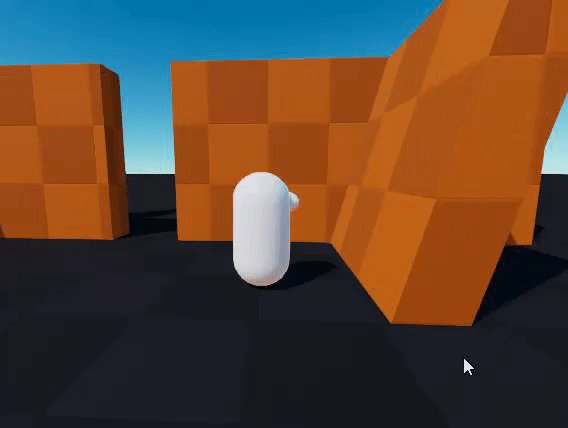
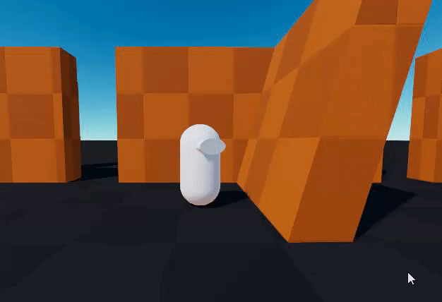

Back to [How To](../how-to.md)

# Prevent Air-Climbing Slopes

If you try to move your standard characters in air against an ungrounded (steep) slope with a high `AirAcceleration`, you might notice that the character can actually air-climb the slope because its acceleration is stronger than gravity. This outcome is physically-accurate in theory, but it is often unwanted, so we need to find a way to avoid it.



A recommended way to solve this is to remove the added air velocity that is caused by inputs if our final character velocity would make us collide with an ungrounded hit. Here is sample code to demonstrate how to implement this in your character processor's `HandleCharacterControl`:

```cs
public void HandleCharacterControl()
{
    if (CharacterBody.IsGrounded)
    {
        // (...)
    }
    else
    {
        float3 airAcceleration = MyCharacterInputs.WorldMoveVector * MyCharacter.AirAcceleration;

        // Prevent Air-Climbing Slopes
        if (MyCharacter.PreventAirClimbingSlopes)
        {
            float3 velocityAfterAcceleration = CharacterBody.RelativeVelocity + (airAcceleration * DeltaTime);
            float3 movementFromVelocity = velocityAfterAcceleration * DeltaTime;
            if(math.lengthsq(movementFromVelocity) > 0f)
            {
                if (KinematicCharacterUtilities.CastColliderClosestCollisions(
                    ref this,
                    in PhysicsCollider,
                    Entity,
                    Translation,
                    Rotation,
                    math.normalizesafe(movementFromVelocity),
                    math.length(movementFromVelocity),
                    true,
                    CharacterBody.ShouldIgnoreDynamicBodies(),
                    out ColliderCastHit hit,
                    out float hitDistance))
                {
                    if (!IsGroundedOnHit(new BasicHit(hit), 0))
                    {
                        // Kill acceleration that would be added from inputs
                        airAcceleration = float3.zero;
                    }
                }
            }
        }

        CharacterControlUtilities.StandardAirMove(ref CharacterBody.RelativeVelocity, airAcceleration, MyCharacter.AirMaxSpeed, GroundingUp, DeltaTime, false);
        
        // (...)
```

This is the end result after the fix:

