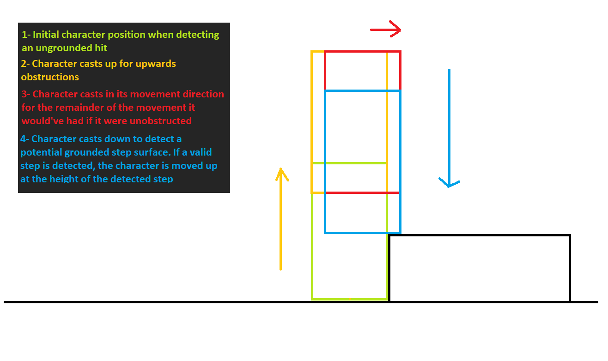

# Step Handling

Step handling is already implemented through the "Processor Callbacks" of the default generated character. It is controlled via the `StepHandling`, `MaxStepHeight`, and `ExtraStepChecksDistance` fields of the character component.

The reason why this is part of the generated character and not part of `KinematicCharacterBody` is because you may want to choose to customize or replace that functionality.

In your character processor's `OnMovementHit`, `KinematicCharacterUtilities.DefaultMethods.OnMovementHit` is called, and this internally calls `CheckForSteppingUpHit`. This will cast colliders to detect steps forward at a certain height. If successful, the character's translation will be moved up to match the detected step height. So on the next movement iteration, the collider cast will not detect an obstruction, and movement will proceed as normal. Here's a representation of what `CheckForSteppingUpHit` does. It casts the character shape up, forward, and then down in order to detect a valid step, and if it does, it moves the character upwards at the height of the step:

But that is not all. A character must also know when it is grounded on a step even when it is not moving (so it knows how to stay still on the edge of a step where the slope angle would make it think it is ungrounded). The character processor's `IsGroundedOnHit` calls `KinematicCharacterUtilities.DefaultMethods.OnMovementHit` by default, which internally calls `IsGroundedOnSteps`. This does the necessary checks for valid grounding when standing on the corner of a step, by using various raycasts.

The `ExtraStepChecksDistance` parameter is used to determine the forward & backward distance of additional raycasts. It is useful to allow being grounded on steps that are not perfectly vertical. In the following image, the orange lines represent the `ExtraStepChecksDistance`, and the red lines are the raycasts done at that distance in order to try to detect valid ground:

## Final note

Step handling is often tricky to get right, and may often be more trouble than it is worth. If you can, you should consider simply **not** using step handling, and instead just place invisible ramp colliders in your level. This is what a lot of games end up doing.