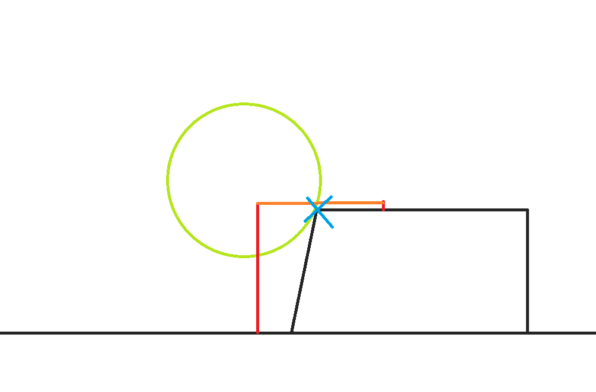

# Step Handling

Step handling is implemented through the "Processor Callbacks" of your generated character.

In your character processor's `OnMovementHit`, first call `KinematicCharacterUtilities.DefaultMethods.CheckForSteppingUpHit`. This will cast colliders to detect steps forward at a certain height. If successful, the outputted `hasSteppedUp` will be true, and the character's translation will be moved up to match the detected step height. So on the next movement iteration, the collider cast will not detect an obstruction, and movement will proceed as normal. This is why we must only call `KinematicCharacterUtilities.DefaultMethods.OnMovementHit` if we have **not** stepped:

```cs
public void OnMovementHit(
        ref KinematicCharacterHit hit,
        ref float3 remainingMovementDirection,
        ref float remainingMovementLength,
        float3 originalVelocityDirection,
        float hitDistance)
{
    KinematicCharacterUtilities.DefaultMethods.CheckForSteppingUpHit(
        ref this,
        ref hit,
        ref CharacterBody,
        ref Translation,
        ref remainingMovementDirection,
        ref remainingMovementLength,
        in PhysicsCollider,
        Entity,
        Rotation,
        GroundingUp,
        hitDistance,
        true, // step handling
        1f, // max step height
        out bool hasSteppedUp);

    if (!hasSteppedUp)
    {
        KinematicCharacterUtilities.DefaultMethods.OnMovementHit(
            ref this,
            ref Translation,
            ref CharacterBody,
            ref VelocityProjectionHitsBuffer,
            ref remainingMovementDirection,
            ref remainingMovementLength,
            originalVelocityDirection,
            hitDistance);
    }
}
```

Here's a representation of what `CheckForSteppingUpHit` does. It casts the character shape up, forward, and then down in order to detect a valid step, and if it does, it moves the character upwards at the height of the step:


## Step Handling for Round-bottom Characters (Capsule, Sphere)

Colliders that do not have a flat bottom are a special case when it comes to step handling. Cylinder or Box character shapes have a flat bottom, and therefore will only need the `CheckForSteppingUpHit` described above in order to work.

For Capsule and Sphere characters, an extra modification is necessary. The default `IsGroundedOnHit` must be replaced with a special `IsGroundedOnHit_ForRoundedColliderStepHandling` which checks for valid grounding when standing on the corner of a step, by using various raycasts.

```cs
public bool IsGroundedOnHit(in BasicHit hit, int groundingEvaluationType)
{
    return KinematicCharacterUtilities.DefaultMethods.IsGroundedOnHit_ForRoundedColliderStepHandling(
        ref this,
        in hit,
        in CharacterBody,
        in PhysicsCollider,
        Entity,
        GroundingUp,
        groundingEvaluationType,
        true, // step handling
        1f, // max step height
        0.1f); // extra step checks distance
}
```

The `ExtraStepChecksDistance` parameter is used to determine the forward & backward distance of additional raycasts. It is useful to allow being grounded on steps that are not perfectly vertical. In the following image, the orange lines represent the `ExtraStepChecksDistance`, and the red lines are the raycasts done at that distance in order to try to detect valid ground:




## Final note

Step handling is tricky to get right, and may often be more trouble than it is worth. If you can, you should consider simply **not** using step handling, and instead just place invisible ramp colliders in your level. This is what a lot of games end up doing.