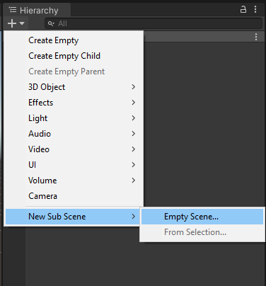
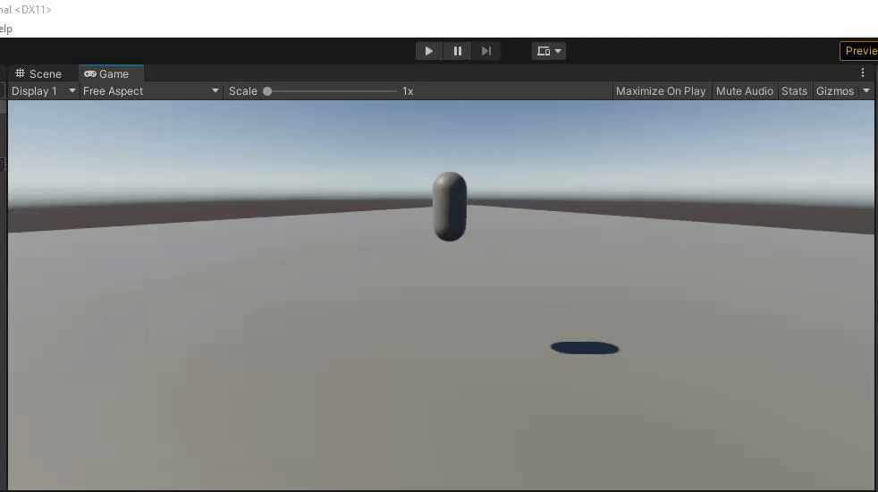

# Tutorial - Basics

We will start by creating a project that is set-up for DOTS, and then create the most basic possible character using Rival.


## Project setup

- Create/Open a Unity project using a Unity version that is verified to work with Rival. Make sure it also uses either the URP or HDRP (required for rendering in DOTS). 
- Go to "Edit > Project Settings > Player Settings", and enable "Allow 'unsafe' code". (Alternatively, if you want your code to be part of an .asmdef, make sure to enable unsafe code in that .asmdef)
- Go to "Edit > Project Settings > Package Manager", and enable "Allow Preview Packages"
- Import the Rival package. This will take care of importing the Entities and Unity.Physics packages into your project, if not already present.
- Import the "Hybrid Renderer" package as well. At the time of writing this, this package is still hidden from the Package Manager, so you can add it to your "Packages\manifest.json" with this line: `"com.unity.rendering.hybrid": "0.11.0-preview.42",` (specific version may have to be updated via the Package Manager window after it was imported)
- (RECOMMENDED) Go to "Edit > Project Settings > Player Settings", and add `ENABLE_HYBRID_RENDERER_V2` to the "Scripting Define Symbols" list. This enables the up-to-date features of the Hybrid Rendered
- (RECOMMENDED) Go to "Edit > Project Settings > Editor". Enable "Enter Play Mode Options", and make sure the "Reload Domain" and "Reload Scene" underneath are both disabled. This will make entering play mode much faster


## Generating the Character Controller Code

- Open up the Character Creation Wizard by going to "Window > Rival > Character Creation Wizard"


- Give a name to your character. Here we will choose "TutorialCharacter"
- Either leave the "Namespace Name" blank, or give it a name
- Leave the "Generated Path" as it is
- Press the "Generate" button


- You should now see the generated files in your project, under "Assets/_GENERATED/Rival"


Note: once your character files are generated, you can safely move them to another folder, edit them, rename them, etc.... but remember that re-generating the files with the same path and character name will overwrite your changes.


## Creating the Character Authoring GameObject

- In a Unity scene, create a new DOTS Subscene for your character GameObject to be in



- Add an empty GameObject to that Subscene. You can name it "Character"
- Add the generated `TutorialCharacterAuthoring` component to that "Character" GameObject. This will also automatically add a `PhysicsShape` component
- Add a child "Capsule" mesh object to this "Character" object, and make sure to *remove the default "Capsule Collider" component* that comes with it
- In the `PhysicsShape` component on the "Character" object, set the "Shape Type" to "Capsule", and click "Fit to Enabled Render Meshes"


- Add a scaled box with a Box `PhysicsShape` to the Subscene to make a floor
- Position the scene's camera in a way where it's looking at the character

At this point, the character is all set-up. You can press Play and it should fall on the floor by itself. However, since we don't have any input handling yet, it won't be controllable.




## Input Handling

Now we must write code to control our character. For the sake of simplicity, the camera will be stationary and the input handling will be very rudimentary. Create a new ECS system called `CharacterInputSystem` that looks like this (all explanations are in the comments):

```cs
using Unity.Burst;
using Unity.Collections;
using Unity.Entities;
using Unity.Jobs;
using Unity.Mathematics;
using Unity.Transforms;
using UnityEngine;

// Make the input system update on variable update, and before the FixedStepSimulationSystemGroup (where the character updates)
[UpdateInGroup(typeof(SimulationSystemGroup), OrderFirst = true)] 
[UpdateBefore(typeof(FixedStepSimulationSystemGroup))]
public class CharacterInputSystem : SystemBase
{
    protected override void OnUpdate()
    {
        // Remember camera directions (since that will be used as a movement direction for the character)
        quaternion cameraRotation = Camera.main.transform.rotation;
        float3 cameraForwardOnUpPlane = math.normalizesafe(Rival.MathUtilities.ProjectOnPlane(Rival.MathUtilities.GetForwardFromRotation(cameraRotation), math.up()));
        float3 cameraRight = Rival.MathUtilities.GetRightFromRotation(cameraRotation);

        // Gather raw input
        float2 moveInput = float2.zero;
        moveInput.y += Input.GetKey(KeyCode.W) ? 1f : 0f;
        moveInput.y += Input.GetKey(KeyCode.S) ? -1f : 0f;
        moveInput.x += Input.GetKey(KeyCode.D) ? 1f : 0f;
        moveInput.x += Input.GetKey(KeyCode.A) ? -1f : 0f;
        bool jumpInput = Input.GetKeyDown(KeyCode.Space);

        // Iterate on all TutorialCharacterInputs components to apply input to them
        Entities
            .ForEach((ref TutorialCharacterInputs characterInputs) => 
            {
                // Make our WorldMoveVector be a vector of magnitude 0 to 1, pointing in the direction of the desired movement (towards camera forward, in this case).
                // The magnitude of this vector represents the fraction of maximum character speed we wish to have in this direction,
                // so a magnitude of 1f will correspond to the max velocity, 0.5f will correspond to half of the max velocity, etc...
                characterInputs.WorldMoveVector = (moveInput.y * cameraForwardOnUpPlane) + (moveInput.x * cameraRight);
                characterInputs.WorldMoveVector = Rival.MathUtilities.ClampToMaxLength(characterInputs.WorldMoveVector, 1f);

                // Remember we want to jump, but only if the jump input is true. The character update will handle resetting that value to false every frame.
                // Since our character updates on a fixed step and our input is gathered at a variable step, this setup is necessary to prevent having your jump
                // input lost between two fixed updates.
                if (jumpInput)
                {
                    characterInputs.JumpRequested = jumpInput;
                }
            }).Schedule();
    }
}
```

If you press Play now, your character should be controllable using WASD to move, and Space to jump. You can play with the parameters under the `TutorialCharacterAuthoring` component add more colliders to your Subscene (walls, ramps, dynamic bodies, etc...) to try things out.

For more information on the fixed-step input handling problem described in the comments over the jump handling, see [Input Handling](input-handling).

In a real project, you will surely want to handle input in a more complex way that will allow you to only apply inputs to a specific player-controlled character Entity, instead of applying input to ALL characters in the scene. The camera transform could also be represented by an Entity instead of just the GameObject camera. But since these things can be highly-specific to your game, Rival does not try to impose any particular way of handling them. You can look at the various sample projects in order to understand how this could be done.
