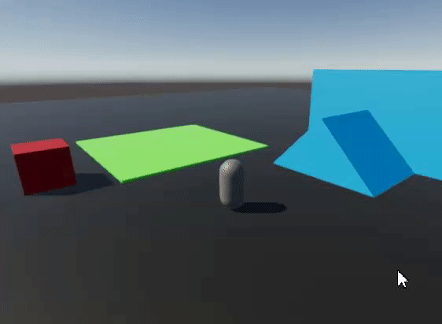

Back to [Tutorial](../tutorial.md)

# Tutorial - Friction Surface

We want to be able to create surfaces where the character has a limited movement speed. To do this, we will first create a new `CharacterFrictionSurface` component:

```cs
using System;
using Unity.Entities;

[Serializable]
[GenerateAuthoringComponent]
public struct CharacterFrictionSurface : IComponentData
{
    public float VelocityFactor;
}
```

Then, we need to make that component accessible from our `ThirdPersonCharacterProcessor`. Here's how we can pass extra data to our processor:
- Add a `public ComponentDataFromEntity<CharacterFrictionSurface> CharacterFrictionSurfaceFromEntity;` field to the `ThirdPersonCharacterProcessor` struct
- Add a `[ReadOnly] public ComponentDataFromEntity<CharacterFrictionSurface> CharacterFrictionSurfaceFromEntity;` field to the `ThirdPersonCharacterJob` struct
- Make `ThirdPersonCharacterSystem` pass that `ComponentDataFromEntity` to the `ThirdPersonCharacterJob`
- Make `ThirdPersonCharacterJob` pass that `ComponentDataFromEntity` to the `ThirdPersonCharacterProcessor`

In short, when we need to add extra data access in `ThirdPersonCharacterProcessor`, we make our `ThirdPersonCharacterSystem` pass that data to the `ThirdPersonCharacterJob`, which in turn passes that data to the `ThirdPersonCharacterProcessor` in its update loop.

```cs
public struct ThirdPersonCharacterProcessor : IKinematicCharacterProcessor
{
    // (...)

    public ComponentDataFromEntity<CharacterFrictionSurface> CharacterFrictionSurfaceFromEntity;
    
    // (...)
}
```

```cs
[UpdateInGroup(typeof(KinematicCharacterUpdateGroup))]
public class ThirdPersonCharacterSystem : SystemBase
{
    [BurstCompile]
    public struct ThirdPersonCharacterJob : IJobEntityBatchWithIndex
    {
        // (...)

        [ReadOnly]
        public ComponentDataFromEntity<CharacterFrictionSurface> CharacterFrictionSurfaceFromEntity;

        // (...)

        public void Execute(ArchetypeChunk chunk, int batchIndex, int indexOfFirstEntityInQuery)
        {
            // (...)

            ThirdPersonCharacterProcessor processor = default;
            // (...)
            processor.CharacterFrictionSurfaceFromEntity = CharacterFrictionSurfaceFromEntity;

            // (...)

            // Iterate on individual characters
            for (int i = 0; i < chunk.Count; i++)
            {
                // (...)
            }
        }
    }
    
    // (...)

    protected unsafe override void OnUpdate()
    {
        // (...)

        Dependency = new ThirdPersonCharacterJob
        {
            // (...)

            CharacterFrictionSurfaceFromEntity = GetComponentDataFromEntity<CharacterFrictionSurface>(true),

            // (...)
        }.ScheduleParallel(CharacterQuery, 1, Dependency);

        // (...)
    }
}

```

At this point, we are ready to use the `CharacterFrictionSurfaceFromEntity` in our character movement implementation in `ThirdPersonCharacterProcessor.HandleCharacterControl`:

```cs
public void HandleCharacterControl()
{
    if (CharacterBody.IsGrounded)
    {
        // Move on ground
        // (...)

        // Handle Sprint
        // (...)

        // Modify final velocity based on friction surface
        if (CharacterFrictionSurfaceFromEntity.HasComponent(CharacterBody.GroundHit.Entity))
        {
            targetVelocity *= CharacterFrictionSurfaceFromEntity[CharacterBody.GroundHit.Entity].VelocityFactor;
        }

        CharacterControlUtilities.StandardGroundMove_Interpolated(ref CharacterBody.RelativeVelocity, targetVelocity, ThirdPersonCharacter.GroundedMovementSharpness, DeltaTime, GroundingUp, CharacterBody.GroundHit.Normal);

        // Jump
        // (...)
    }
    else
    {
        // (...)
    }
    
    // (...)
}
```

Finally, you can add a new box object to the Subscene, with a Box `PhysicsShape`, and a `CharacterFrictionSurface` component. If you set the `VelocityFactor` to something like 0.2 on that `CharacterFrictionSurface` and you press Play, you should see your character move much slower on that surface.

