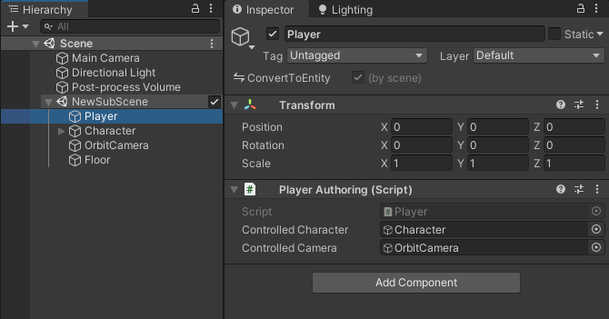
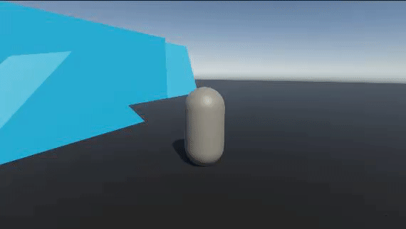

Back to [Tutorial](../tutorial.md)

# Tutorial - Input Handling

Now we must write code to control our character with keyboard inputs, and our camera with mouse inputs. 

Here's an overview of how we're going to accomplish this:
* Create a `Player` component representing a human player controlling a specific character & camera
* Assign the character entity as the controlled character in that `Player` component
* Assign the camera entity as the controlled camera in that `Player` component
* Create a `PlayerSystem` that will gather inputs, and for each `Player`, apply those inputs to the player's assigned character & camera


Let's start by creating the `Player`: 

```cs
using System;
using Unity.Entities;

[Serializable]
[GenerateAuthoringComponent]
public struct Player : IComponentData
{
    public Entity ControlledCharacter;
    public Entity ControlledCamera;
}
```

After creating this component:
* add a new empty GameObject to your Subscene, call it "Player"
* add the `Player` authoring component to it
* in the `Player` component inspector, assign the character object to the `ControlledCharacter` field
* in the `Player` component inspector, assign the camera object to the `ControlledCamera` field



Next, we will create the `PlayerSystem`, which will handle player input for character & camera control):

```cs
using Unity.Burst;
using Unity.Collections;
using Unity.Entities;
using Unity.Jobs;
using Unity.Mathematics;
using Unity.Transforms;
using UnityEngine;

// Make the input system update on variable update, and before the FixedStepSimulationSystemGroup (where the character updates)
[UpdateInGroup(typeof(SimulationSystemGroup), OrderFirst = true)]
[UpdateBefore(typeof(FixedStepSimulationSystemGroup))]
public class PlayerSystem : SystemBase
{
    protected override void OnCreate()
    {
        base.OnCreate();

        // Optional: Lock the cursor
        Cursor.lockState = CursorLockMode.Locked;
        Cursor.visible = false;
    }

    protected override void OnUpdate()
    {
        // Gather raw input
        float2 moveInput = float2.zero;
        moveInput.y += Input.GetKey(KeyCode.W) ? 1f : 0f;
        moveInput.y += Input.GetKey(KeyCode.S) ? -1f : 0f;
        moveInput.x += Input.GetKey(KeyCode.D) ? 1f : 0f;
        moveInput.x += Input.GetKey(KeyCode.A) ? -1f : 0f;
        bool jumpInput = Input.GetKeyDown(KeyCode.Space);
        float2 cameraLookInput = new float2(Input.GetAxis("Mouse X"), Input.GetAxis("Mouse Y"));
        float cameraZoomInput = -Input.mouseScrollDelta.y;

        // Iterate on all Player components to apply input to their character
        Entities
            .ForEach((ref Player player) =>
            {
                // Character control
                if (HasComponent<TutorialCharacterInputs>(player.ControlledCharacter))
                {
                    // Calculate camera directions (will be used for character movement directions)
                    quaternion cameraRotation = GetComponent<Rotation>(player.ControlledCamera).Value;
                    float3 cameraForwardOnUpPlane = math.normalizesafe(Rival.MathUtilities.ProjectOnPlane(Rival.MathUtilities.GetForwardFromRotation(cameraRotation), math.up()));
                    float3 cameraRight = Rival.MathUtilities.GetRightFromRotation(cameraRotation);

                    TutorialCharacterInputs characterInputs = GetComponent<TutorialCharacterInputs>(player.ControlledCharacter);

                    // Make our WorldMoveVector be a vector of magnitude 0 to 1, pointing in the direction of the desired movement (towards camera forward, in this case).
                    // The magnitude of this vector represents the fraction of maximum character speed we wish to have in this direction,
                    // so a magnitude of 1f will correspond to the max velocity, 0.5f will correspond to half of the max velocity, etc...
                    characterInputs.WorldMoveVector = (moveInput.y * cameraForwardOnUpPlane) + (moveInput.x * cameraRight);
                    characterInputs.WorldMoveVector = Rival.MathUtilities.ClampToMaxLength(characterInputs.WorldMoveVector, 1f);

                    // Remember we want to jump, but only if the jump input is true. The character update will handle resetting that value to false every frame.
                    // Since our character updates on a fixed step and our input is gathered at a variable step, this setup is necessary to prevent having your jump
                    // input lost between two fixed updates.
                    if (jumpInput)
                    {
                        characterInputs.JumpRequested = jumpInput;
                    }

                    // Don't forget to write back the data to the component
                    SetComponent(player.ControlledCharacter, characterInputs);
                }

                // Camera control
                if (HasComponent<OrbitCameraInputs>(player.ControlledCamera))
                {
                    OrbitCameraInputs cameraInputs = GetComponent<OrbitCameraInputs>(player.ControlledCamera);

                    cameraInputs.Look = cameraLookInput; // This is the camera X and Y rotation input
                    cameraInputs.Zoom = cameraZoomInput; // This is the camera zoom input

                    // Don't forget to write back the data to the component
                    SetComponent(player.ControlledCamera, cameraInputs);
                }
            }).Schedule();
    }
}
```

If you press Play now, your character should be controllable using WASD to move, and Space to jump. The camera should also be controllable with the mouse move and scroll wheel. You can play with the parameters under the `TutorialCharacterAuthoring` and `OrbitCamera` components, and add more colliders to your Subscene (walls, ramps, dynamic bodies, etc...) to try things out.



For more information on the fixed-step input handling problem described in the comments over the jump handling, see [Input Handling](../How_To/input-handling.md).