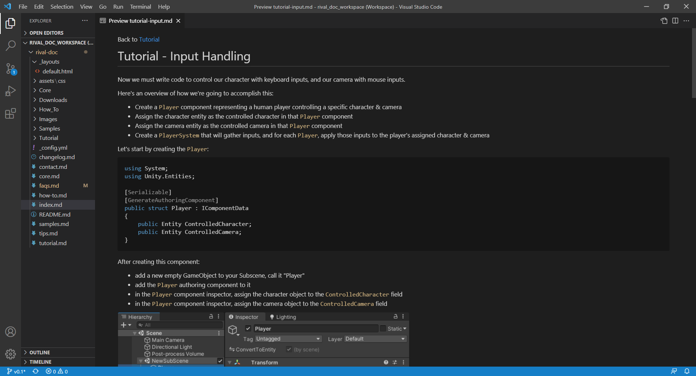

# FAQs

## Is this compatible with regular GameObject & Monobehaviour projects?
No, this asset is only compatible with DOTS projects. More specifically, it requires you to use the ECS (Entities package) and DOTS Physics (UnityPhysics or Havok).

## How customizable is this character controller?
You can think of this character controller as a special kind of rigidbody that knows how to deal with grounding and does its own custom collision detection. You are in control of giving it a velocity and a rotation, and then the character logic solves collisions based on those. It is not tied to any game genre (it can be used for FPS, TPS, platformers, etc....) and does not come pre-packaged with any sort of specific gameplay feature (not even basic move speeds or gravity). You are fully in control of telling the character how to move & behave, and the character controller only solves the collisions & grounding aspect.

It does **not** deal with input, animation or cameras at all. These things are all for you to implement, but there are sample projects available to demonstrate implementations of these things. The entire job & update loop of the character is code-generated and exposed to users, so they are free to insert steps at any point and modify the default implementation as they see fit.

The characters in the Samples project are meant to demonstrate the customization possibilities of Rival. This includes:
* Third person character
* First person character
* Client-predicted movement in online games
* Double-jumping
* Moving platforms
* Pushing & being pushed by dynamic rigidbodies
* Standing on a moving dynamic vehicle
* Climbing a surface
* Wall-running
* Swimming
* Hanging on a ledge
* Swinging from a rope
* Crouching
* Flying
* Contextual collision filtering (through code)
* Sliding on ice surfaces
* Step handling
* Snapping to the ground, unless there is a downward slope change exceeding X angles
* Arbitrary gravity and character up direction (ex: walking on a round planet, walking on walls)
* etc...

## Is this character controller dynamic or kinematic?
It uses a kinematic rigidbody. However, it can optionally have a mode where it immitates a dynamic body by manually detecting contacts with other physics bodies and applying velocity changes on itself. The end result is a kinematic character controller that can have a high level of interaction with dynamic bodies. It can smoothly push or be pushed by other dynamic bodies.

## Does this character controller support standing on moving physics bodies?
Yes, it can stand on any physics body (kinematic, static, dynamic) and doesn't require them to be moved in any special way. All it requires is for a specific compoenent (TrackedTransform) to be added to the entities that the character should be able to stand on.

## Is this character controller suitable for networked games?
Yes. An Online FPS sample project is available, and it uses proper network prediction for the character. This FPS sample project uses DOTS NetCode, but any other networking solution could also be used.

## What kinds of physics shapes does this character controller support?
Any convex physics shape is supported, and in any orientation. You can have a collision shape based on a capsule, a cylinder, a box, a sphere, etc...

## Can I download this documentation website, and view it locally offline?
Yes, you can go to the [github repository](https://github.com/PhilSA/rival-doc) of this documentation website, and download the branch corresponding to the version of Rival you have. Once downloaded, the documentation can be viewed with any markdown viewer, by opening `index.md` as a starting point.

For example, you can use [VS Code](https://code.visualstudio.com/) to open the parent folder of the downloaded documentation, and then open the `index.md` file, and press CTRL+Shift+V to open a markdown preview of the selected file.

