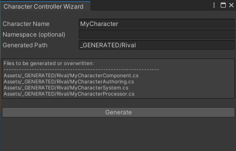

# Getting Started

NOTE: You must use Unity 2020.3 when using Rival. This is the version recommended by Unity for all DOTS projects until further notice

Here are the recommended first steps you should take with Rival:
1. Finish reading this whole page
1. Install the [Samples](./samples.md) project (installation details are on the Samples page) and play around with the various samples.
1. Follow the [Tutorial](./tutorial.md) from start to finish. This will show you how to setup a DOTS project correctly, and teach you how to create characters with Rival.

## Using the Standard Characters & Cameras

The easiest way to get started is with the [Standard Characters](./standard-characters.md) package included in the Rival package. This package contains pre-made FirstPerson & ThirdPerson characters and cameras. You can add these to your project as a starting point, and start customizing them to your liking.

These characters are very similar to those generated by the Character Controller Wizard (see next section), but they come with default input & camera handling as well as drag-n-drop prefabs to make your life easier.

## Using the Character Controller Wizard

As an alternative to the Standard Characters package, the Character Controller Wizard is a window that allows you to generate all the files necessary for the creation of a completely new character controller. It can be accessed through Unity's top bar menu: `Window > Rival > Character Controller Wizard`. 

The workflow looks like this:
- Generate the code for your new character by using the Character Controller Wizard. 
- Add the generated character authoring component to a GameObject.
- Customize the character's implementation inside of the generated files, and/or in extra systems. The generated characters are very similar to the ones from the standard packages, but they don't come with camera & input handling.

You can specify the name, namespace (optional), and path of the generated character controller files, and an info box gives you a preview of what exactly will be generated. Once you've entered a name, namespace, and path, click the "Generate" button to create the files.

See [Code Structure](./Core/code-structure.md) for an overview of what the generated files do.

## Useful Links

See [Tutorial](./tutorial.md) for a guided step-by-step tutorial on creating and customizing a new character from scratch.

See [Standard Characters](./standard-characters.md) for a package containing pre-made FirstPerson & ThirdPerson characters and cameras.

See [Samples](./samples.md) for a sample project containing various games and test scenes made using Rival.

See [Core](./core.md) for an in-depth overview of the core components & systems. 

See [How To](./how-to.md) for explanations on how to implement various character features.

See [Tips](./tips.md) for a list of particularities to be aware of, and performance tips.
